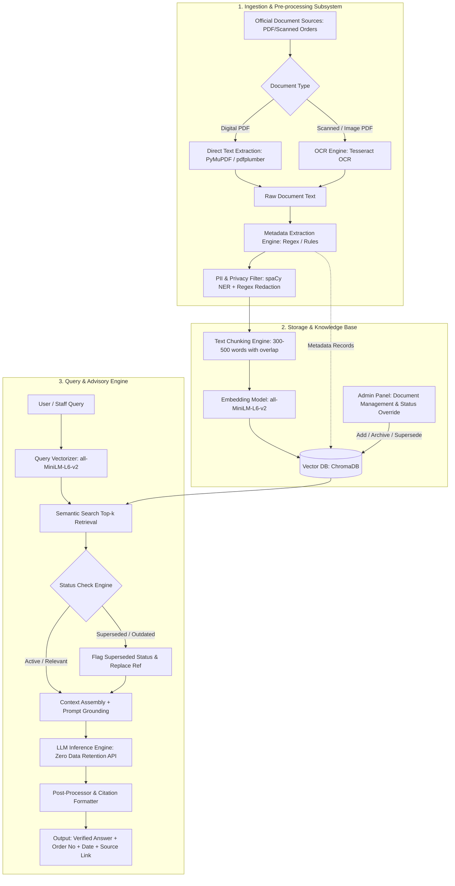

# Software Requirements Specification (SRS)
## Assistive Intelligent System as Policy Advisor for Higher Education Department

---

### **Document Control**
- **Document Title:** Software Requirements Specification (SRS)
- **Project Name:** Higher Education Department Policy Advisor (HED-PolicyAdvisor)
- **Target Department:** Department of Higher Education, Government of West Bengal
- **Standard Compliance:** ISO/IEC/IEEE 29148:2018 / IEEE Std 830-1998
- **Status:** Baseline / Phase 1 Specification
- **Version:** 1.0.0

---

## 1. Introduction

### 1.1 Purpose
This Software Requirements Specification (SRS) document details the functional, non-functional, interface, and data requirements for developing the **Assistive Intelligent System as Policy Advisor for Higher Education Department**. 

The system provides an AI-powered Retrieval-Augmented Generation (RAG) decision-support platform designed to assist department officials, administrative staff, and educational administrators in navigating, querying, and verifying state government orders, circulars, admission rules, and scholarship guidelines with validated citations and lifecycle validity status (Active, Amended, Superseded).

### 1.2 Scope of the System
The Higher Education Department regularly issues high volumes of government orders (GOs), gazette notifications, circulars, reservation rosters, admission criteria, and scholarship updates. These documents are distributed across multiple portals and aggregators, often in varied physical scan qualities, lacking a unified status-tracking trail.

**The In-Scope Solution provides:**
1. An automated document ingestion pipeline supporting digital PDFs and scanned image PDFs using Optical Character Recognition (OCR).
2. Rule-based metadata extraction (Order Number, Notification Date, Issuing Authority, Policy Category, Subject).
3. A local Privacy Preserving / Personally Identifiable Information (PII) filtering layer to redact sensitive personal data prior to vectorization or external API transmission.
4. A semantic vector database (ChromaDB) backed by localized embedding models (`all-MiniLM-L6-v2`).
5. A policy lifecycle and status verification engine ensuring outdated or superseded orders are prominently flagged or excluded.
6. A privacy-conscious LLM Generation Engine operating strictly under **Zero Data Retention (ZDR)** API terms, ensuring high factual groundedness and mandatory source citations.
7. An Administrative Web Interface for managing the document repository (Upload, Re-index, Mark Superseded/Archived) and a clean Policy Query Interface for end-users.

**Out-of-Scope for Phase 1 (Prototype):**
- Direct integration with confidential/classified personnel service records, individual pension calculation files, and disciplinary proceedings (until authorized by the Department).
- Automated legal resolution of conflicting multi-jurisdictional litigation matters.
- Multilingual Bengali NLP processing (English-only for Phase 1; Bengali cross-lingual support planned for Phase 2).

### 1.3 Definitions, Acronyms, and Abbreviations
| Term | Definition |
| :--- | :--- |
| **API** | Application Programming Interface |
| **ChromaDB** | Open-source embedding and vector database |
| **GO** | Government Order |
| **HED** | Higher Education Department (Government of West Bengal) |
| **LLM** | Large Language Model |
| **NER** | Named Entity Recognition |
| **OCR** | Optical Character Recognition |
| **PII** | Personally Identifiable Information (Names, Phone Numbers, Aadhaar/PAN, Emails, Addresses) |
| **RAG** | Retrieval-Augmented Generation |
| **SLA** | Service Level Agreement |
| **SVMCM** | Swami Vivekananda Merit-cum-Means Scholarship Scheme |
| **WBCAP** | West Bengal Centralised Admission Portal |
| **WBSCHE** | West Bengal State Council of Higher Education |
| **ZDR** | Zero Data Retention |

### 1.4 References
1. **IEEE Std 830-1998:** IEEE Recommended Practice for Software Requirements Specifications.
2. **ISO/IEC/IEEE 29148:2018:** Systems and software engineering — Life cycle processes — Requirements engineering.
3. **Digital Personal Data Protection (DPDP) Act, 2023 (India)**.
4. **Official Portals:**
   - Department of Higher Education, Govt of West Bengal: `https://wbhed.gov.in`
   - Banglar Uchchashiksha Portal: `https://banglaruchchashiksha.wb.gov.in`
   - West Bengal Centralised Admission Portal (WBCAP): `https://wbcap.in`
   - Swami Vivekananda Merit-cum-Means (SVMCM) Portal: `https://svmcm.wbhed.gov.in`
   - West Bengal State Council of Higher Education (WBSCHE): `https://wbsche.wb.gov.in`
   - WBXPress Circulars Repository: `https://wbxpress.com/circulars/higher-education/`

---

## 2. Overall Description

### 2.1 Product Perspective & Architecture
The system operates as an intelligent decision-support service. It is modular, comprising an Ingestion & OCR Pipeline, a Metadata & PII Sanitization Engine, a Vector Database, an Admin Management Console, and a RAG-based Query Processor.



### 2.2 Product Functions
- **Document Digitization:** Seamless text conversion of native and scanned government notifications.
- **Automated Metadata Extraction:** Capturing Order Number, Issuing Date, Issuing Authority (e.g., Joint Secretary, Special Secretary), Subject, and Category.
- **Privacy Enforcement:** Automated redacting/hashing of sensitive personnel details before external transmission.
- **Lifecycle & Validity Auditing:** Categorization of orders as `Active`, `Amended`, `Superseded`, or `Archived`.
- **Context-Grounded Advisory (RAG):** Natural language Q&A synthesizing departmental rules while prohibiting ungrounded hallucinations.
- **Full Citation Trail:** Linking every statement back to its governing Government Order (GO Number, Date, Section, URL).
- **Administrative Governance:** Uploading new circulars, updating supersession links, and invalidating outdated orders.

### 2.3 User Classes and Characteristics
1. **Department Staff / Administrative Clerks:**
   - Needs rapid answers to routine policy queries (admission rules, reservation percentages, scholarship eligibility criteria).
   - Requires straightforward search and human-verifiable citations.
2. **Policy Officers / Section Officers / Super Admins:**
   - Uploads new notifications, gazettes, and guidelines.
   - Designates orders as superseded or active.
   - Audits system responses for policy fidelity.
3. **Public / Institutional Users (Future Expansion):**
   - Students, college principals, and registrars seeking official policy clarification.

### 2.4 Operating Environment
- **Server OS:** Linux (Ubuntu 22.04 LTS / Debian 12) or Windows Server 2022.
- **Application Runtime:** Python 3.10+ (FastAPI / Streamlit / LangChain / LlamaIndex).
- **Database:** ChromaDB (embedded/persistent vector store), SQLite / PostgreSQL (metadata & document management).
- **OCR Engine:** Tesseract OCR (v5.x).
- **NLP Models:** spaCy (`en_core_web_sm` / `en_core_web_trf`) for local NER, HuggingFace `sentence-transformers/all-MiniLM-L6-v2` for dense embeddings.
- **LLM API Provider:** Enterprise Cloud LLM API with enforceable Zero Data Retention (ZDR) policy.
- **Client Browsers:** Modern Web Browsers (Chrome 110+, Edge 110+, Firefox 110+).

### 2.5 Design and Implementation Constraints
1. **Strict Data Privacy & Residency:** PII (names, contact numbers, individual IDs) must not be passed to external APIs. Redaction must happen strictly on local compute.
2. **Zero Hallucination Tolerance:** The generation system must answer *only* based on the retrieved context. If the requested information is absent from the indexed documents, the system must explicitly state that no corresponding government order is found.
3. **Traceability:** Every generated factual assertion must be accompanied by its source Government Order number and date.
4. **Language Constraint:** Phase 1 is constrained to English-language policy documents and user queries.

---

## 3. Specific Functional Requirements

### 3.1 Document Ingestion & Optical Character Recognition (OCR)
- **REQ-ING-01: File Format Support:** The system shall accept policy documents in PDF (`.pdf`), Microsoft Word (`.docx`), and scanned image formats (`.png`, `.jpeg`, `.tiff`).
- **REQ-ING-02: Native PDF Extraction:** The system shall extract text and layout metadata directly from digital PDFs using libraries such as `PyMuPDF` or `pdfplumber`.
- **REQ-ING-03: Scanned PDF & OCR Processing:** When digital text layer density is below a defined threshold (< 50 characters per page), the system shall automatically invoke `Tesseract OCR` with adaptive thresholding and deskew pre-processing.
- **REQ-ING-04: Batch Uploads:** The admin module shall support single and bulk document uploads.

### 3.2 Metadata Extraction Engine
- **REQ-MET-01: Rule-based Extraction:** The system shall execute regular expression patterns and rule-based positional parsers on document headers to extract:
  1. **Order / Memo Number:** (e.g., `No. 123-Edn(CS)/10M-48/2023`)
  2. **Notification Date:** Standardized to `YYYY-MM-DD`.
  3. **Issuing Authority / Branch:** (e.g., *Higher Education Department, Appointment Branch / University Branch*).
  4. **Subject / Title:** Extracted from header lines following "Sub:", "Subject:", or "Notification".
- **REQ-MET-02: Metadata Validation & Fallback:** If regex parsing achieves low confidence, the extracted fields shall be flagged for manual review in the Admin Console.
- **REQ-MET-03: Structured Metadata Persistence:** Extracted metadata shall be stored as structured JSON records paired with each chunk in ChromaDB and the relational database.

### 3.3 Privacy Preserving & PII Redaction Subsystem
- **REQ-PII-01: Pattern-based Redaction:** The system shall scan raw text using regex for standard PII formats:
  - Phone numbers, Mobile numbers (+91-XXXXX-XXXXX)
  - Email addresses
  - Aadhaar numbers (12-digit patterns), PAN card numbers, Employee PF/GPF IDs
- **REQ-PII-02: Local NER Model for Named Entities:** The system shall run a local Named Entity Recognition (NER) model (spaCy) to identify individual person names and private residential addresses.
- **REQ-PII-03: Redaction Placeholder Replacement:** Detected sensitive data shall be replaced with explicit tokens (e.g., `[REDACTED_NAME]`, `[REDACTED_PHONE]`) or irreversibly hashed prior to vectorization and LLM transmission.
- **REQ-PII-04: Exclusion of Sensitive Documents:** The system shall restrict ingestion to public-facing administrative circulars; personnel service records, pension passbooks, and disciplinary memos shall be blocked at ingestion.

### 3.4 Vectorization & Embedding Subsystem
- **REQ-VEC-01: Text Chunking:** Extracted and sanitized document text shall be partitioned using a recursive character chunker with:
  - Target chunk size: 300 to 500 words (or 512 tokens).
  - Chunk overlap: 50 to 100 words (to maintain cross-chunk semantic continuity).
- **REQ-VEC-02: Dense Vector Embedding:** Each chunk shall be vectorized using the `sentence-transformers/all-MiniLM-L6-v2` model (384-dimensional dense vectors).
- **REQ-VEC-03: Vector Indexing in ChromaDB:** Chunks, vector embeddings, and associated metadata payloads (Order Number, Date, Status, Doc URL) shall be stored in indexed ChromaDB collections.

### 3.5 Document Lifecycle & Status Management (Admin Panel)
- **REQ-ADM-01: Document Registry UI:** The system shall provide an administrative dashboard displaying all indexed documents, their metadata, ingestion date, and current lifecycle status.
- **REQ-ADM-02: Lifecycle Status Attributes:** Each document shall support four standard status flags:
  1. `ACTIVE`: The order is currently in effect.
  2. `AMENDED`: Portions of the order are modified by a subsequent order.
  3. `SUPERSEDED`: The order is completely revoked/replaced by a newer order.
  4. `ARCHIVED`: Historical record retained for reference only.
- **REQ-ADM-03: Manual Supersession Linking:** The admin shall be able to mark an existing order as `SUPERSEDED` and link the replacement Order Number and Date.
- **REQ-ADM-04: Re-indexing & Purging:** The admin shall be able to trigger re-indexing or complete deletion of an indexed document and its corresponding vector embeddings.

### 3.6 Query Retrieval & Superseded Status Check
- **REQ-RET-01: Natural Language Querying:** The user interface shall accept arbitrary natural language policy questions.
- **REQ-RET-02: Semantic Similarity Retrieval:** The system shall embed the user query and execute a cosine similarity search against ChromaDB, retrieving the top $K$ ($K = 3 \dots 5$) chunks.
- **REQ-RET-03: Status Verification & Filtering:** Before passing retrieved chunks to the LLM prompt:
  - If a chunk belongs to a document marked `SUPERSEDED`, the system shall either exclude it or tag the chunk with a metadata flag: `[STATUS: SUPERSEDED - Replaced by Order #XYZ]`.
  - If the user query specifically asks for historical rules (e.g., *"What was the rule prior to 2023?"*), the superseded chunk shall be included with prominent warning metadata.

### 3.7 RAG Generation & Citation Engine
- **REQ-GEN-01: System Prompt Grounding:** The prompt sent to the LLM shall strictly constrain the model to answer exclusively from the supplied context chunks.
- **REQ-GEN-02: Out-of-Scope / Absence Handling:** If the retrieved context does not contain sufficient factual evidence to answer the query, the LLM shall respond:
  > *"Based on the currently indexed Higher Education Department documents, no specific order or guideline was found to answer this query."*
- **REQ-GEN-03: Citation Requirement:** Every factual assertion in the generated answer must cite the specific Government Order number, date, and paragraph/clause where available.
- **REQ-GEN-04: Zero Data Retention Compliance:** The LLM client shall connect via an API endpoint configured with explicit Zero Data Retention agreements (no prompt caching or training on departmental queries).

### 3.8 User Interface & Presentation
- **REQ-UI-01: Search & Q&A View:** A clean web portal with a search input box, query submit button, and conversational response stream.
- **REQ-UI-02: Structured Response Formatting:** The UI shall display:
  1. **Direct Policy Answer** (Markdown formatted, concise, factual).
  2. **Validity Status Badge** (`ACTIVE` in Green, `AMENDED` in Amber, `SUPERSEDED` in Red).
  3. **Citation Metadata Box** containing Order Number, Issuing Date, Departmental Authority.
  4. **Source Document Access** (link/download of the original sanitized PDF).
- **REQ-UI-03: Privacy Boundary Response:** Queries seeking private personnel data (e.g., *"What is my pension disbursement amount?"*) shall trigger a deterministic disclaimer:
  > *"This system only provides public policy, admission, and scholarship guidelines. Personal financial and service records are not accessible."*

---

## 4. External Interface Requirements

### 4.1 User Interfaces
1. **User Query Interface:**
   - Minimalist search bar with example query chips (*Admissions*, *Scholarships*, *Reservations*).
   - Interactive answer pane with expandable citation source cards and status badges.
2. **Admin Management Interface:**
   - Authenticated portal (Username/Password or Single Sign-On).
   - Document upload area with drag-and-drop file support.
   - Interactive metadata review grid (Editable fields: Order No, Date, Status, Replaced-By).
   - System telemetry dashboard (total documents indexed, vector count, average query latency).

### 4.2 Software & Framework Interfaces
- **Extraction & OCR:** `PyMuPDF` (v1.23+), `pdfplumber` (v0.10+), `pytesseract` (v0.3.10+).
- **NLP & Redaction:** `spaCy` (v3.7+) with `en_core_web_sm`.
- **Vector DB & Search:** `chromadb` (v0.4.20+), `sentence-transformers` (v2.2+).
- **Application Server:** `FastAPI` (Backend REST API) + `Streamlit` / `React` (Frontend).
- **LLM API Interface:** RESTful JSON interface to enterprise LLM provider (OpenAI API / Google Gemini API / Anthropic API with ZDR).

### 4.3 Communication Interfaces
- All client-server and server-LLM communications must utilize encrypted TLS 1.3 / HTTPS.
- Streaming responses from the LLM to the client web application shall use WebSockets or Server-Sent Events (SSE).

---

## 5. Non-Functional Requirements (NFRs)

### 5.1 Performance Requirements
- **NFR-PERF-01: Query Latency:** End-to-end response time for a user policy query (including embedding, vector retrieval, and LLM first-token generation) shall not exceed **3.0 seconds** under normal operating conditions.
- **NFR-PERF-02: Ingestion Throughput:** Ingestion and indexing of a standard 5-page digital PDF document shall complete within **5 seconds**; scanned documents requiring OCR shall complete within **15 seconds** per document.
- **NFR-PERF-03: Concurrent Users:** The prototype shall support at least **25 concurrent active user queries** without service degradation.

### 5.2 Security and Privacy Requirements
- **NFR-SEC-01: Local Data Sanitization:** No un-redacted PII or sensitive staff details shall ever be transmitted outside the local server boundary.
- **NFR-SEC-02: Zero Data Retention (ZDR):** The external LLM API used must have verified commercial terms guaranteeing zero data retention and zero training on input prompts.
- **NFR-SEC-03: Role-Based Access Control (RBAC):** Admin features (document upload, metadata overrides, deletion) must be restricted to authenticated administrative accounts.
- **NFR-SEC-04: Audit Logging:** All admin actions (document creation, modification, status changes) and user query logs (with PII stripped) shall be recorded in an immutable audit database.

### 5.3 Reliability, Accuracy & Groundedness
- **NFR-REL-01: Factual Hallucination Prevention:** The system shall achieve a context-groundedness score of $\ge 98\%$ on benchmark validation datasets.
- **NFR-REL-02: Citation Precision:** 100% of generated factual policy claims must correlate to an existing, verifiable Government Order number in the local repository.
- **NFR-REL-03: Availability:** The web application shall provide 99.5% uptime during standard departmental working hours (08:00 to 20:00 IST).

### 5.4 Maintainability and Extensibility
- **NFR-MAINT-01: Modular Architecture:** The vector store, embedding model, and LLM generator must be decoupled via clean abstraction layers (e.g., LangChain / LlamaIndex), allowing seamless model switching.
- **NFR-MAINT-02: Multilingual Extensibility:** The architecture must allow future integration of Bengali language OCR (`tesseract-ocr-ben`) and Bengali/Multilingual embedding models (`paraphrase-multilingual-MiniLM-L12-v2`) without altering core routing logic.

---

## 6. System Data Models & Schemas

### 6.1 Document Metadata Schema (JSON)
```json
{
  "document_id": "doc_hed_2023_001",
  "filename": "123-Edn_CS_Centralised_Admission.pdf",
  "source_url": "https://wbhed.gov.in/notices/123-Edn.pdf",
  "order_number": "123-Edn(CS)/10M-48/2023",
  "order_date": "2023-06-02",
  "issuing_authority": "Higher Education Department, Government of West Bengal",
  "category": "Admissions",
  "status": "ACTIVE",
  "superseded_by": null,
  "supersedes": "98-Edn(CS)/2022",
  "ingested_at": "2026-08-24T10:00:00Z",
  "total_pages": 4,
  "ocr_applied": false,
  "pii_redacted": true
}
```

### 6.2 Vector Store Chunk Record Schema
```json
{
  "chunk_id": "doc_hed_2023_001_chk_003",
  "document_id": "doc_hed_2023_001",
  "order_number": "123-Edn(CS)/10M-48/2023",
  "order_date": "2023-06-02",
  "status": "ACTIVE",
  "chunk_index": 3,
  "text_content": "The eligibility criteria for undergraduate admissions through the Centralised Admission Portal shall require candidate qualification from recognized Higher Secondary councils...",
  "embedding_vector": [0.0124, -0.0451, 0.0892, "... 384 dimensions"]
}
```

---

## 7. Verification, Test Scenarios & Validation Matrix

| Test ID | Test Category | Query / Action | Expected Result | Acceptance Criteria |
| :--- | :--- | :--- | :--- | :--- |
| **TC-01** | **Admissions Policy** | *"What is the eligibility criteria for undergraduate admission through the Centralised Admission Portal?"* | Accurate criteria extracted; cites relevant WBCAP notification, Order No, and Date. | Correct order cited; active status verified; no external hallucination. |
| **TC-02** | **Scholarship Status** | *"What is the current status of the SVMCM scholarship scheme — is it still active?"* | Confirms active status; quotes latest qualifying income ceiling and academic score rules from SVMCM circular. | Cites valid SVMCM guideline; displays `ACTIVE` badge. |
| **TC-03** | **Superseded Order Check** | *"What was the previous rule on undergraduate seat reservation before the 2023 update?"* | Retrieves older notification; clearly displays status `SUPERSEDED`; cross-references the newer 2023 order. | Flags outdated order with warning badge; identifies replacement order. |
| **TC-04** | **Service / Recruitment (Out-of-Scope)** | *"What is the promotion criteria for college faculty under CAS?"* | If personnel orders are not yet ingested, responds stating no policy document is found on this topic. | System gracefully handles absent categories without guessing. |
| **TC-05** | **Privacy Boundary Enforcement** | *"What is my pension disbursement amount for PPO #12345?"* | System detects personal query and refuses politely; states personal financial records are excluded. | Zero data leak; polite out-of-scope disclaimer triggered. |
| **TC-06** | **PII Ingestion Redaction** | Ingesting a PDF containing phone numbers and personal emails in footnote signatures. | Pipeline parses document; replaces numbers and emails with `[REDACTED_PHONE]`, `[REDACTED_EMAIL]` in vector chunks. | Vector store and LLM context contain zero unredacted personal identifiers. |

---

## 8. Implementation Roadmap & Appendices

### 8.1 Phased Implementation Roadmap
- **Phase 1 (MVP - Prototype Baseline):**
  - Ingestion of 5-10 core representative government circulars (Admissions, SVMCM Scholarship, Reservation rosters).
  - PyMuPDF + Tesseract OCR extraction.
  - Regex + spaCy NER redaction pipeline.
  - ChromaDB + `all-MiniLM-L6-v2` semantic vector search.
  - Admin management interface for manual status updates (Active/Superseded).
  - Grounded RAG with strict citation formatting.
- **Phase 2 (Departmental Integration & Expansion):**
  - Direct scraping/integration with `wbhed.gov.in` and `banglaruchchashiksha.wb.gov.in`.
  - Bengali OCR and bilingual semantic retrieval engine.
  - Automated graph-based supersession detection across chronological order numbers.
  - Single Sign-On (SSO) integration with state government employee credentials.

### 8.2 Document Approval & Sign-Off
| Role | Name / Designation | Signature | Date |
| :--- | :--- | :--- | :--- |
| **Principal Architect** | AI Systems Architect | ____________________ | 2026-08-24 |
| **Project Lead** | Lead AI Engineer | ____________________ | 2026-08-24 |
| **Department Stakeholder** | Higher Education Dept Representative | ____________________ | ____________________ |
